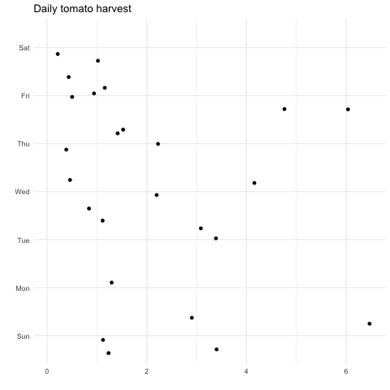
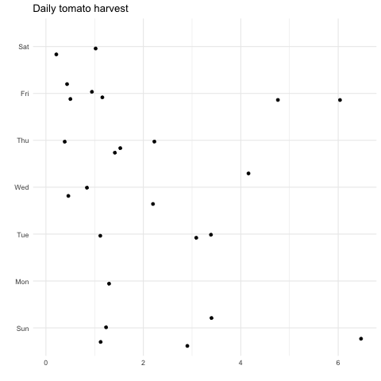
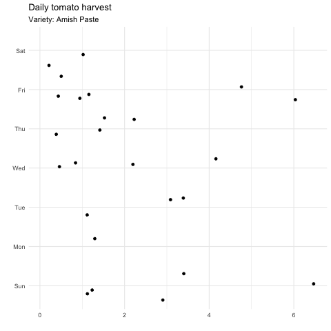
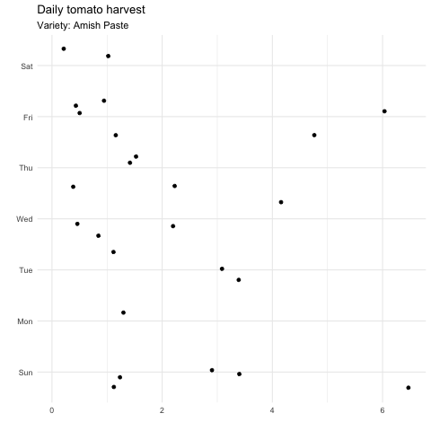
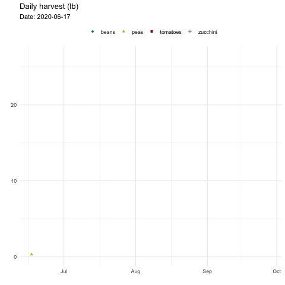
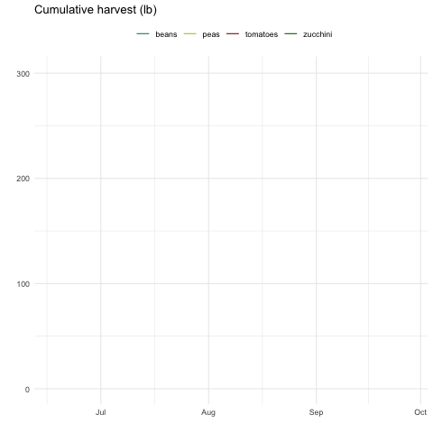
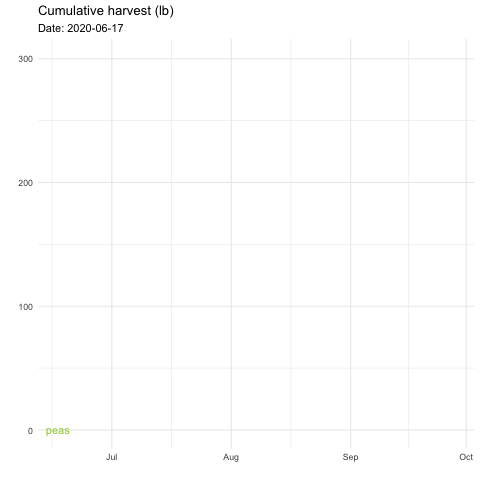
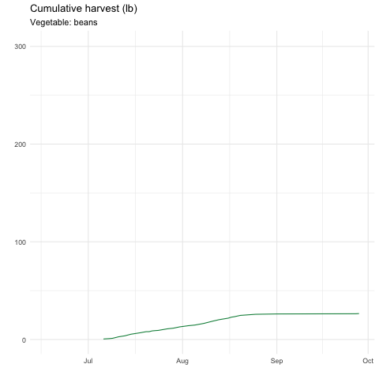

## Setup

Welcome to another tutorial for this class, COMP/STAT 112: *Introduction to Data Science*! It will be similar to the others, including demo videos and files embedded in this document and practice problems with hints or solutions at the end. There are some new libraries, so be sure to install those first. There are also some additional instructions (especially if you're using the server) down below the demo section.

As most of our files do, we start this one with three R code chunks: 1. options, 2. libraries and settings, 3. data. 

```{r setup}
knitr::opts_chunk$set(echo = TRUE, 
                      message = FALSE, 
                      warning = FALSE)
```

```{r libraries}
library(tidyverse)     # for data cleaning and plotting
library(gardenR)       # for Lisa's garden data
library(lubridate)     # for date manipulation
library(openintro)     # for the abbr2state() function
library(palmerpenguins)# for Palmer penguin data
library(maps)          # for map data
library(ggmap)         # for mapping points on maps
library(gplots)        # for col2hex() function
library(RColorBrewer)  # for color palettes
library(sf)            # for working with spatial data
library(leaflet)       # for highly customizable mapping
library(ggthemes)      # for more themes (including theme_map())
library(plotly)        # for the ggplotly() - basic interactivity
library(gganimate)     # for adding animation layers to ggplots
library(gifski)        # for creating the gif (don't need to load this library every time,but need it installed)
library(transformr)    # for "tweening" (gganimate)
library(shiny)         # for creating interactive apps
theme_set(theme_minimal())
```

```{r my_libraries, include=FALSE}
# Lisa needs this, students don't
library(downloadthis) # for including download buttons for files
library(flair)        # for highlighting code
library(xaringanExtra)# for small slides and other cool things
```

```{r data}
# Lisa's garden data
data("garden_harvest")
```

## Learning Goals

After this tutorial, you should be able to do the following:

* Add basic interactivity to a `ggplot2` plot using `ggplotly()`.  

* Add animation layers to plots using `gganimate` functions.  

* Create a shiny app that requires inputs.  

* Publish a shiny app to shinyapps.io.


## Easy interactivity with `plotly`

Probably the easiest way to add interactivity to a plot created with `ggplot2` is by using the `ggplotly()` function from the `plotly` library. The `plotly` package can do A LOT more than what we'll cover in this course as it is a plotting framework if its own. But, it can do a lot with just that one function. 

Let's look at an example. In the code below, I compute the cumulative harvest in pounds by vegetable and create a bar graph.  I save the graph and print it out. The code and graph should be familiar.

```{r}
veggie_harvest_graph <- garden_harvest %>% 
  group_by(vegetable) %>% 
  summarize(total_wt_lbs = sum(weight)*0.00220462) %>% 
  ggplot() +
  geom_col(aes(x = total_wt_lbs, 
               y = fct_reorder(vegetable, 
                               total_wt_lbs, 
                               .desc = FALSE))) +
  labs(title = "Total Harvest by vegetable (lb)", 
       x = "",
       y = "")

veggie_harvest_graph
```

Now, we `plotly`-ify it!

```{r}
ggplotly(veggie_harvest_graph)
```

The labeling is fairly ugly in the graph above. I can fix some of that by editing my original plot. In the code below, I add a `text` aesthetic, which will be used in `ggplotly()` to display the vegetable name, and use `tooltip` to tell it the aesthetics to display when scrolling over the graph.

```{r ggplotly-ex, echo=FALSE, eval=FALSE}
veggie_harvest_graph2 <- garden_harvest %>% 
  group_by(vegetable) %>% 
  summarize(total_wt_lbs = sum(weight)*0.00220462) %>% 
  ggplot() +
  geom_col(aes(x = total_wt_lbs, 
               y = fct_reorder(vegetable, 
                               total_wt_lbs, 
                               .desc = FALSE),
               text = vegetable)) +
  labs(title = "Total Harvest by vegetable (lb)", 
       x = "",
       y = "")

ggplotly(veggie_harvest_graph2,
         tooltip = c("text", "x"))
```


```{r, echo=FALSE}
decorate_chunk("ggplotly-ex") %>% 
  flair("text = vegetable") %>% 
  flair("tooltip =")
```


This works for many different types of plots created with `ggplot2`. 

### Resources

[Plotly's ggplot2 integration](https://plotly.com/ggplot2/)

### Your turn!

#### Exercise

In this exercise, choose 2 graphs you have created for ANY assignment in this class and add interactivity using the `ggplotly()` function. 

## Adding animation with `gganimate`

### Key functions

The `gganimate` package works well with `ggplot2` functions by providing additional grammar that assists in adding animation to the plots. These functions get added as layers in `ggplot()`, just like you are used to adding `geom_*()` layers and other layers that modify the graph.

From Thomas Pedersen's documentation, here are the key functions/grammar of the package:

* `transition_*()` defines how the data should be spread out and how it relates to itself across time (time is not always actual time).
* `view_*()` defines how the positional scales should change along the animation.
* `shadow_*()` defines how data from other points in time should be presented in the given point in time.
* `enter_*()/exit_*()` defines how new data should appear and how old data should disappear during the course of the animation.
* `ease_aes()` defines how different aesthetics should be eased during transitions.

You only need a `transition_*()` or `view_*()` function to add animation. This tutorial focuses on three `transition_*()` functions: `transition_states()`, `transition_time()`, and `transition_reveal()`. 

### Creating an animated plot with `gganimate`

1. Create your base `ggplot()`  
2. Add appropriate `geom_*()` layers.  
3. Add any other stylistic additions (themes, titles, etc.)  
4. Add `gganimate` `transition_*()` layer  
5. Add `gganimate` options, which may include making some changes in the `ggplot()` code.

### `transition_*()` functions

The following image, taken from the gganimate cheatsheet, gives a nice overview of the three functions. 


#### `transition_states()`

This transition is used to transition between distinct stages of the data. We will show an example of transitioning between levels of a categorical variable. We will use the `garden_harvest` dataset and will follow the steps outlined above for creating an animated plot.

First, we create a dataset of daily tomato harvests in pounds for each variety of tomato. We add day of week and reorder variety from most to least harvested.

```{r}
daily_tomato <- garden_harvest %>% 
  filter(vegetable == "tomatoes") %>% 
  group_by(variety, date) %>% 
  summarize(daily_harvest = sum(weight)*0.00220462) %>% 
  mutate(day_of_week = wday(date, label = TRUE)) %>% 
  ungroup() %>% 
  mutate(variety = fct_reorder(variety, daily_harvest, sum, .desc = TRUE)) 

daily_tomato
``` 

Next, we create a jittered scatterplot of daily harvest by day of week. We facet the plot by variety.

```{r}
daily_tomato %>% 
  ggplot(aes(x = daily_harvest, 
             y = day_of_week)) +
  geom_jitter() +
  facet_wrap(vars(variety)) +
  labs(title = "Daily tomato harvest",
       x = "",
       y = "") 
```

Now, instead of looking at the data by faceting, we will use animation and transition by variety. This code takes a while to run. And the animation shows up over in the Viewer in the lower right-hand pane, rather than in the preview below the code chunk.

```{r tomato-gganimate, eval=FALSE, echo=FALSE}
daily_tomato %>% 
  ggplot(aes(x = daily_harvest, 
             y = day_of_week)) +
  geom_jitter() +
  labs(title = "Daily tomato harvest",
       x = "",
       y = "") +
  transition_states(variety)
```


```{r, echo=FALSE}
decorate_chunk("tomato-gganimate", eval=FALSE) %>% 
  flair("transition_states(variety)")
```

```{r, eval=FALSE, echo=FALSE}
anim_save("tomatoes1.gif")
```

```{r, echo=FALSE}

```

Because it takes a while to create the animation, you don't want to recreate it each time you knit your file. So, in the code chunk where you create the animation, add `eval=FALSE` to the code chunk options (ie. inside the curly brackets next to the lowercase r). 

Then, save the gif using the `anim_save()` function, like in the code below. The name in quotes is the name of the file that will be created, which needs to end in .gif. This will automatically save your *most recent* `gganimate` plot. So, be sure to run the code right after you create the animation. Alternatively, you can save your `gganimate`, say you called it `plot1` and do `anim_save(plot_1, "tomatoes1.gif")`. This will be saved to your *working directory*. If you are working in a project (hopefully the one linked to your GitHub repo, right?), then this will go to the main folder for the project if that is where the .Rmd file is located. 

```{r, eval=FALSE}
anim_save("tomatoes1.gif")
```

Then, load the file back in using the following code. You can add `echo=FALSE` to the code chunk options to omit displaying the code. 

```{r, eval=FALSE}

```

Now, let's return to the animation that was created. There are a couple things we should fix. One is that as it animates, it looks like the observations from one `variety` morph into the observations from the next `variety.` We can fix this in two ways. One, is to color by `variety`: 

```{r tomato-gganimate2, eval=FALSE, echo=FALSE}
daily_tomato %>% 
  ggplot(aes(x = daily_harvest, 
             y = day_of_week,
             color = variety)) +
  geom_jitter() +
  scale_color_viridis_d(option = "magma") +
  labs(title = "Daily tomato harvest",
       x = "",
       y = "",
       color = "") +
  theme(legend.position = "none") +
  transition_states(variety)
```

```{r, echo=FALSE}
decorate_chunk("tomato-gganimate2", eval=FALSE) %>% 
  flair("color = variety") %>% 
  flair('scale_color_viridis_d(option = "magma")') %>% 
  flair("color =") %>% 
  flair('theme(legend.position = "none")')
```

```{r, eval=FALSE, echo=FALSE}
anim_save("tomatoes2.gif")
```

```{r, echo=FALSE}

```

Another, is to map `variety` to the `group` aesthetic (This is the recommended way to do it, even if we also color by `variety`.): 

```{r tomato-gganimate3, eval=FALSE, echo=FALSE}
daily_tomato %>% 
  ggplot(aes(x = daily_harvest, 
             y = day_of_week,
             group = variety)) +
  geom_jitter() +
  labs(title = "Daily tomato harvest",
       x = "",
       y = "") +
  transition_states(variety)
```

```{r, echo=FALSE}
decorate_chunk("tomato-gganimate3", eval=FALSE) %>% 
  flair("group = variety")
```

```{r, eval=FALSE, echo=FALSE}
anim_save("tomatoes3.gif")
```

```{r, echo=FALSE}

```

Another issue is that we don't see the `variety` names as it animates through. Thankfully, the various `transition_*()` functions create some useful variables we can use to display the names of `variety`. The variables created are shown below. 


We can access the variables by putting them in square brackets inside a label. Below, I use the `closest_state` variable that is created to add the `variety` to the subtitle of the plot.

```{r tomato-gganimate4, eval=FALSE, echo=FALSE}
daily_tomato %>% 
  ggplot(aes(x = daily_harvest, 
             y = day_of_week,
             group = variety)) +
  geom_jitter() +
  labs(title = "Daily tomato harvest",
       subtitle = "Variety: {closest_state}",
       x = "",
       y = "") +
  transition_states(variety)
```

```{r, echo=FALSE}
decorate_chunk("tomato-gganimate4", eval=FALSE) %>% 
  flair('subtitle = "Variety: {closest_state}"')
```

```{r, eval=FALSE, echo=FALSE}
anim_save("tomatoes4.gif")
```

```{r, echo=FALSE}

```

There are many options we can change. Below, we make a couple more changes.

* Save the animated plot as `tomato_gganim` and output the animation using `animate()` in order to control the duration (there are other options in that function, too).

* Change the relative transition lengths (how long it takes to switch `variety`) and state lengths (how long it stays on a variety). These are relative lengths, so the transition time is twice as long as the time spent in a state.  

* Shrink the points as `variety` transitions using `exit_shrink()`.  

* Color the points light blue as they enter and exit. 

```{r tomato-gganimate5, eval=FALSE, echo=FALSE}
tomato_gganim <- daily_tomato %>% 
  ggplot(aes(x = daily_harvest, 
             y = day_of_week,
             group = variety)) +
  geom_jitter() +
  labs(title = "Daily tomato harvest",
       subtitle = "Variety: {closest_state}",
       x = "",
       y = "") +
  transition_states(variety, 
                    transition_length = 2, 
                    state_length = 1) +
  exit_shrink() +
  enter_recolor(color = "lightblue") +
  exit_recolor(color = "lightblue")

animate(tomato_gganim, duration = 20)
```

```{r, echo=FALSE}
decorate_chunk("tomato-gganimate5", eval=FALSE) %>% 
  flair("transition_length = 2") %>% 
  flair("state_length = 1") %>% 
  flair("exit_shrink()") %>% 
  flair('enter_recolor(color = "lightblue")') %>% 
  flair('exit_recolor(color = "lightblue")') %>% 
  flair("animate(tomato_gganim, duration = 20)") %>% 
  flair("tomato_gganim <-")
```

```{r, eval=FALSE, echo=FALSE}
anim_save("tomatoes5.gif")
```

```{r, echo=FALSE}

```

#### `transition_time()`

This transition is used to transition between distinct states in time. We will show an example of transitioning over harvest dates in the `garden_harvest` dataset.  We will follow the steps outlined earlier for creating an animated plot.


First, we create a dataset of daily harvest in pounds for a subset of four vegetables.

```{r}
daily_harvest_subset <- garden_harvest %>% 
  filter(vegetable %in% c("tomatoes", "beans", 
                          "peas", "zucchini")) %>% 
  group_by(vegetable, date) %>% 
  summarize(daily_harvest_lb = sum(weight)*0.00220462) 

daily_harvest_subset
```

Then, we create a static plot, coloring the points differently and assigning different shapes to distinguish the various green colors. 

```{r}
daily_harvest_subset %>% 
  ggplot(aes(x = date, 
             y = daily_harvest_lb,
             color = vegetable,
             shape = vegetable)) +
  geom_point() +
  labs(title = "Daily harvest (lb)", 
       x = "",
       y = "",
       color = "vegetable",
       shape = "vegetable") +
  scale_color_manual(values = c("tomatoes" = "darkred",
                       "beans" = "springgreen4",
                       "peas" = "yellowgreen",
                       "zucchini" = "darkgreen")) +
  theme(legend.position = "top",
        legend.title = element_blank()) 
```

Now we animate the plot, transiting over time by `date`.

```{r veg1, eval=FALSE, echo=FALSE}
daily_harvest_subset %>% 
  ggplot(aes(x = date, 
             y = daily_harvest_lb,
             color = vegetable,
             shape = vegetable)) +
  geom_point() +
  labs(title = "Daily harvest (lb)", 
       x = "",
       y = "",
       color = "vegetable",
       shape = "vegetable") +
  scale_color_manual(values = c("tomatoes" = "darkred",
                                "beans" = "springgreen4",
                                "peas" = "yellowgreen",
                                "zucchini" = "darkgreen")) +
  theme(legend.position = "top",
        legend.title = element_blank()) +
  transition_time(date)
```

```{r, echo=FALSE}
decorate_chunk("veg1", eval=FALSE) %>% 
  flair("transition_time(date)")
```

```{r, eval=FALSE, echo=FALSE}
anim_save("veg1.gif")
```

```{r, echo=FALSE}

```

Now, let's try adding some other features:

* Keep a little history of the data via `shadow_wake()`  

* Fade the old data points out via `exit_fade()`

* Add a date subtitle using the `frame_time` variable created from `transition_time()`.

```{r veg2, eval=FALSE, echo=FALSE}
daily_harvest_subset %>% 
  ggplot(aes(x = date, 
             y = daily_harvest_lb,
             color = vegetable,
             shape = vegetable)) +
  geom_point() +
  labs(title = "Daily harvest (lb)", 
       subtitle = "Date: {frame_time}",
       x = "",
       y = "",
       color = "vegetable",
       shape = "vegetable") +
  scale_color_manual(values = c("tomatoes" = "darkred",
                                "beans" = "springgreen4",
                                "peas" = "yellowgreen",
                                "zucchini" = "darkgreen")) +
  theme(legend.position = "top",
        legend.title = element_blank()) +
  transition_time(date) +
  shadow_wake(wake_length = .3) +
  exit_fade()
```

```{r, echo=FALSE}
decorate_chunk("veg2", eval=FALSE) %>% 
  flair("shadow_wake(wake_length = .3)") %>% 
  flair("exit_fade()") %>% 
  flair('subtitle = "Date: {frame_time}"')
```

```{r, eval=FALSE, echo=FALSE}
anim_save("veg2.gif")
```

```{r, echo=FALSE}

```

#### `transition_reveal()`

This transition allows you to let data gradually appear. We will show an example of building up the cumulative harvest data over harvest dates using the `garden_harvest` dataset.  We will follow the steps outlined earlier for creating an animated plot.

First we create a dataset of cumulative harvest by date for a subset of vegetables.

```{r}
cum_harvest_subset <- garden_harvest %>% 
  filter(vegetable %in% c("tomatoes", "beans", 
                          "peas", "zucchini")) %>% 
  group_by(vegetable, date) %>% 
  summarize(daily_harvest_lb = sum(weight)*0.00220462) %>% 
  mutate(cum_harvest_lb = cumsum(daily_harvest_lb))

cum_harvest_subset
```

Next, we create a static plot of cumulative harvest, coloring the lines by vegetable.

```{r}
cum_harvest_subset %>% 
  ggplot(aes(x = date, 
             y = cum_harvest_lb,
             color = vegetable)) +
  geom_line() +
  labs(title = "Cumulative harvest (lb)", 
       x = "",
       y = "",
       color = "vegetable") +
  scale_color_manual(values = c("tomatoes" = "darkred",
                       "beans" = "springgreen4",
                       "peas" = "yellowgreen",
                       "zucchini" = "darkgreen")) +
  theme(legend.position = "top",
        legend.title = element_blank())
```

And now, add animation! 

```{r veg-cum1, eval=FALSE, echo=FALSE}
cum_harvest_subset %>% 
  ggplot(aes(x = date, 
             y = cum_harvest_lb,
             color = vegetable)) +
  geom_line() +
  labs(title = "Cumulative harvest (lb)", 
       x = "",
       y = "",
       color = "vegetable") +
  scale_color_manual(values = c("tomatoes" = "darkred",
                       "beans" = "springgreen4",
                       "peas" = "yellowgreen",
                       "zucchini" = "darkgreen")) +
  theme(legend.position = "top",
        legend.title = element_blank()) +
  transition_reveal(date)
```


```{r, echo=FALSE}
decorate_chunk("veg-cum1", eval=FALSE) %>% 
  flair("transition_reveal(date)")
```

```{r, eval=FALSE, echo=FALSE}
anim_save("vegcum1.gif")
```

```{r, echo=FALSE}

```

And now let's do a couple things to improve the plot:

* Remove the legend and add text that shows vegetable name on the plot (I love this!). 

* Add date to the subtitle.

```{r veg-cum2, eval=FALSE, echo=FALSE}
cum_harvest_subset %>% 
  ggplot(aes(x = date, 
             y = cum_harvest_lb,
             color = vegetable)) +
  geom_line() +
  geom_text(aes(label = vegetable)) +
  labs(title = "Cumulative harvest (lb)", 
       subtitle = "Date: {frame_along}",
       x = "",
       y = "",
       color = "vegetable") +
  scale_color_manual(values = c("tomatoes" = "darkred",
                       "beans" = "springgreen4",
                       "peas" = "yellowgreen",
                       "zucchini" = "darkgreen")) +
  theme(legend.position = "none") +
  transition_reveal(date)
```


```{r, echo=FALSE}
decorate_chunk("veg-cum2", eval=FALSE) %>% 
  flair('legend.position = "none"') %>% 
  flair("geom_text(aes(label = vegetable))") %>% 
  flair('subtitle = "Date: {frame_along}"')
```

```{r, eval=FALSE, echo=FALSE}
anim_save("vegcum2.gif")
```

```{r, echo=FALSE}

```

We could have used this same data with a different type of transition. It's always good to think about the point you are trying to make with the animation.

```{r veg-cum3, eval=FALSE, echo=FALSE}
cum_harvest_subset %>% 
  ggplot(aes(x = date, 
             y = cum_harvest_lb,
             color = vegetable)) +
  geom_line() +
  labs(title = "Cumulative harvest (lb)", 
       subtitle = "Vegetable: {closest_state}",
       x = "",
       y = "",
       color = "vegetable") +
  scale_color_manual(values = c("tomatoes" = "darkred",
                       "beans" = "springgreen4",
                       "peas" = "yellowgreen",
                       "zucchini" = "darkgreen")) +
  theme(legend.position = "none") +
  transition_states(vegetable)
```

```{r, echo=FALSE}
decorate_chunk("veg-cum3", eval=FALSE) %>% 
  flair('subtitle = "Vegetable: {closest_state}"') %>% 
  flair("transition_states(vegetable)")
```

```{r, eval=FALSE, echo=FALSE}
anim_save("vegcum3.gif")
```

```{r, echo=FALSE}

```

### Demo video

Now watch the demo video!

<iframe width="560" height="315" src="https://www.youtube.com/embed/Yyfi96xiBMo" frameborder="0" allow="accelerometer; autoplay; clipboard-write; encrypted-media; gyroscope; picture-in-picture" allowfullscreen></iframe>

[Voicethread: `gganimate` demo](https://voicethread.com/myvoice/create/15619897)

```{r, echo=FALSE}
download_file(
  path = "gganimate_demo_no_code.Rmd",
  button_label = "Download gganimate demo file (without code)",
  button_type = "warning",
  has_icon = TRUE,
  icon = "fa fa-save",
  self_contained = FALSE
)
```

```{r, echo=FALSE}
download_file(
  path = "gganimate_demo.Rmd",
  button_label = "Download gganimate demo file (with code)",
  button_type = "info",
  has_icon = TRUE,
  icon = "fa fa-save",
  self_contained = FALSE
)
```

### Resources

* [gganimate intro slides](https://goodekat.github.io/presentations/2019-isugg-gganimate-spooky/slides.html) by Katherine Goode (she animates bats flying!)

* [gganimate cheatsheet](https://ugoproto.github.io/ugo_r_doc/pdf/gganimate.pdf)

* [gganimate by Thomas Pedersen](https://github.com/thomasp85/gganimate) - scroll down to the bottom  
* [Pedersen introductory vignette](https://cran.r-project.org/web/packages/gganimate/vignettes/gganimate.html) - gives a brief intro to what each of the key functions do  
* [gganimate wiki page](https://github.com/thomasp85/gganimate/wiki) - most of this is currently under development but there's some good examples  

* [ropensci examples](https://github.com/ropenscilabs/learngganimate)

### Setting up `gganimate`

This package *might* require some extra setup.

* Make sure you can load the following packages: `gganimate`, `gifski`, `transformr`. First, try just installing `gganimate` and see if you can load all the other packages after only installing that one. If so, you are done. If not, try installing the other packages. After you install them all, RESTART RStudio. Hopefully you have success at that point. If not, talk to me. If you are using Macalester's server, you will likely have to do the next step.

* If you use Macalester's server, you will almost surely get an error when you try to install `gifski`. The error will say something about not have RUST and will direct you to the [Rust](https://www.rust-lang.org/) website. Click [Getting started](https://www.rust-lang.org/learn/get-started). 

  - In the *terminal*, try typing `rustup update`. If that is successful, you are done. If it tells you something about not having Rust, then go to the next step.  
  - If the previous step was not successful, try running the following in the *terminal*: `curl --proto '=https' --tlsv1.2 -sSf https://sh.rustup.rs | sh` (this is from the Click [Getting started](https://www.rust-lang.org/learn/get-started) Rust page and could be slightly out of date - go to that page to assure the code is correct). This may run on its own or it may give you some options. Always type the yes options in the terminal.  
  - After installing, close the session (go to house icon in top right) and open a new session.  
  - Now install the gifski library. If that runs successfully, close the R session and open a new one. If that was all successful, you should be able to create animations!

### Your turn!

Use animation to tell an interesting story with the `small_trains` dataset that contains data from the SNCF (National Society of French Railways). These are Tidy Tuesday data! Read more about it [here](https://github.com/rfordatascience/tidytuesday/tree/master/data/2019/2019-02-26).

```{r}
small_trains <- read_csv("https://raw.githubusercontent.com/rfordatascience/tidytuesday/master/data/2019/2019-02-26/small_trains.csv") 
```

## Creating an app with `shiny`

In this section, we will learn how to create a Shiny App. Shiny Apps are applications that allow the user to interact or make changes to graphs or tables. You will learn how to create them in R and how to deploy them on your own [shinyapps.io](shinyapps.io) webpage. See examples of some apps [here](https://shiny.rstudio.com/gallery/).

### Concept Map

The concept map below illustrates the key components of a shiny app and how they relate to one another. We will go through more detail during the tutorial.


### Slides

I am doing this tutorial a bit differently than I've done other tutorials. I am going to walk you through the creation of a shiny app by following the intro_to_shiny slides on my GitHub page. You can download the slides below. I will include short screen captures to illustrate how to do each part on your own.

```{r, echo=FALSE}
download_file(
  path = "../05_intro_to_shiny/intro_to_shiny.html",
  button_label = "Download intro_to_shiny slides",
  button_type = "info",
  has_icon = TRUE,
  icon = "fa fa-save",
  self_contained = FALSE
)
```

### Getting the files

To begin, you are going to copy everything from my GitHub repo to your own GitHub repo. You do this by *forking*. From your GitHub account, search for mine: llendway/intro_to_shiny. Once there, click the fork button. Then, all my files will be in a repo of the same name on your GitHub page.

{width="90%"}

From there, clone the repo and create a new project in R Studio.

Once you've done that, you can access all the files from your computer. As you make changes, you can commit and push them out to your own GitHub account, if you'd like.

### Creating an app

Creating a Shiny app is different from what we've done so far in this class. One of the biggest changes, is that we'll be working from .R files, rather than .Rmd files. In .R files, *everything* is read as R code. So, it's like one big R code chunk. If you want to make comments, you need to use the pound/hashtag symbol, `#`.

Let's start by opening the `basic_app_template.R` file in the `app_files` folder. Since you've cloned the repo, this will be one of the files in your project folder. Make sure you have the project open first! Open the file and click Run App. This is a *really* boring app - there is nothing there! But, it is a great starting point because it gives you an outline of what you need in order to make your app work.

{width="90%"}

Before getting into a lot of details, let's add a little bit to the app. At the top of the file, load the `tidyverse` and `babynames` libraries and add some text between quotes inside the `fluidPage()` function.Run the app. You can check that you did this right by looking in the `basic_app_add_more.R` file.

{width="90%"}

Now, let's move on to creating a more interesting app. The goal is to create a Shiny app for my kids to explore the `babynames` dataset! Remember, that's their favorite.

Requirements: 

* Show the number of babies with a given name over time.  
* Allow the user to type a single name. (Ideally, it should give a message if there are no records of the name that was typed, but we won't worry about that now.)  
* Allow the user to choose a range of years they would like to display. 
* Allow the user to filter by sex.

#### The details

How do we do this?

Setup:

1. Create folder (either create a new project or put it in the project folder you forked and cloned from my repo). Give the folder a name that describes the app.  
2. Open new *R Script* file (*not* .Rmd file)  
3. Copy and paste code from the basic_app_add_more.R file  
4. Save the R Script file as app.R into the folder you just created.  

{width="90%"}

Fun parts:

5. Add `ui` components  
6. Add `server` components  
7. Deploy to shinyapps.io to share with the world!

Let's learn more about these fun parts!

#### What is an app.R file?

Like we've already seen in the sample app files, these contain two key components:

* `ui`: the user interface. This is the webpage that your user will interact with. Don't worry, you don't need to know how to write html! The app will do that for you! (Although if you want to, there are opportunities to use html.)

* `server`: the computer part. What should the computer/server do with your inputs as the user changes them. This section will have R code in it, more like we're used to ... sort of.

I always keep these names as the default. The last chunk of code at the bottom, `shinyApp(ui = ui, server = server)`, will compile everything together to result in the interactive webpage.

We will add different `*Input()` and `*Output()` functions to the `ui`.  

* The `*Input*()` functions collect inputs from the user.  
* The `*Output()` functions work with the `render*()` functions in the `server` portion to to add R output to the UI. 

Have the [cheatsheet](https://shiny.rstudio.com/images/shiny-cheatsheet.pdf) open at all times! It is extremely helpful.

#### `*Input()` functions

The `*Input*()` functions collect inputs from the user. The various types are listed on the right-hand side of the first page of the cheatsheet. You will list all the `*Input()` functions you want to use with their accompanying arguments inside the `fluidPage()` function in the `ui` portion. Separate the `*Input()` functions with commas. In the basic_app_template, add three inputs inside the `fluidPage()` function. Be sure to separate them with commas.

In all the `*Input()` functions, the first two arguments are the same: `inputId` is how you will call this input in the `server` portion later, `label` is how this will actually be labeled in your UI. Each function has some additional arguments depending what you want to do.

In the `app.R` file you just created, add three inputs inside the `fluidPage()` function. Be sure to separate them with commas.

* `sliderInput()` to choose the start and end year for the eventual graph.  
* `textInput()` to write a name.  
* `selectInput()` to choose a sex.

Once you complete all the necessary arguments, run your app. Make sure you can enter and move things around as expected. There won't be a graph yet because we haven't created it. You can check your results by looking at the `babynames_app_step1.R` file (I've also added a couple extra things - see if you can figure out what they do).

#### `*Output()` functions

`*Output()` functions in the `ui` portion work with the `render*()` functions in the `server` portion to to add R output to the UI. The `*Output()` functions are listed in the bottom center part of the first page of the cheatsheet. 

All the `*Output()` functions have the same first argument, `outputId`, which is used how you will call this output in the `server` portion later (like the `inputId` in the `*Input()` functions).

Now, add a `plotOutput()` to the `fluidPage()` function. Run the app with the output. You can check your work by looking at the `babynames_app_step2.R` file. Notice that nothing really changes. Think of this output as a placeholder. So, it knows there is going to be a plot in the UI, but the details of what the plot will look like and the R code to create it will be in the server portion. Let's talk about that!

#### Using `render*()` functions 

In the server portion of the code, we will use `render*()` functions with R code to communicate how to use the input pieces along with the R code to create the desired output. The `render*()` function you use will depend on the desired output. The bottom center of the cheatsheet shows how `*Output()` and `render*()` functions connect.

In general, the `server` section of code will look something like this:

```{r eval=FALSE}
server <- function(input, output) {
  output$outputId_of_interest <- render*({
R code that creates the output and calls various input$InputId's
  })
}
```

So, if inside the `ui` part, we did `plotOutput(outputId = "timeplot")`, then in the `server` part, we would use `output$timeplot <- renderPlot({...})` and put in detailed R code in place of the `...`. To reference the inputs we created in the `ui`, we use `input$inputID_name`. So, for example, if we had an `*Input()` with `inputId = "years"`, we would use `input$years` in the `server` portion.

Now, since we are interested in creating a plot, add the `renderPlot()` function inside the `server` portion of the code. Reference the inputs you've already created in previous parts and use `filter()` and `ggplot()` to render the desired interactive plot. Run the app and check your work by looking at the `babynames_app_basic.R` file or in the code chunk below (so don't look ahead, if you want to try it out on your own!). I also added a submit button to the UI so everything is updated at the same time, only when the button is clicked. You should try adding that, too.

Below, I have also included all the R code used to create the app. I have highlighted the `inputId` and `outputId` similarly in the `ui` and `server` portions to draw attention to where they are referenced. 

```{r app-code, eval=FALSE, echo=FALSE}
library(shiny)
library(tidyverse)
library(babynames)

ui <- fluidPage(
  sliderInput(inputId = "years", 
              label = "Year Range",
              min = 1880, 
              max = 2019, 
              value = c(1880,2019),
              sep = ""),
  textInput("name", 
            "Name", 
            value = "", 
            placeholder = "Lisa"),
  selectInput("sex", 
              "Sex", 
              choices = list(Female = "F", Male = "M")),
  submitButton(text = "Create my plot!"),
  plotOutput(outputId = "timeplot")
)

server <- function(input, output) {
  output$timeplot <- renderPlot({
  babynames %>% 
    filter(name == input$name, 
           sex == input$sex) %>% 
    ggplot() +
    geom_line(aes(x = year, y = n)) +
    scale_x_continuous(limits = input$years) +
    theme_minimal()
  })
}

shinyApp(ui = ui, server = server)
```

```{r, echo=FALSE}
decorate_chunk("app-code", eval = FALSE) %>% 
  flair('"years"') %>% 
  flair("input$years") %>% 
  flair('"name"', background = "orange") %>% 
  flair("input$name", background = "orange") %>% 
  flair('"sex"', background = "lightgreen") %>% 
  flair("input$sex", background = "lightgreen") %>% 
  flair('"timeplot"', background = "lightblue") %>% 
  flair("output$timeplot", background = "lightblue")
```

#### Publishing your app

1. Install and load the `rsconnect` library in your R Studio session. 
2. Register at [https://www.shinyapps.io/admin/#/signup](https://www.shinyapps.io/admin/#/signup).  
3. Once you are logged in to shinyapps.io, go to Account --> Tokens and click the Show button.  
4. Copy and paste the code into the console in R. This will connect your account to R Studio. 
5. When you create an app, save it as `app.R` in a folder. It **MUST** be named `app.R`. In the `app.R` file, load all libraries you use in your code. Also try not to have extra libraries or it will take longer to get it on the website. Any data that your app uses needs to be read in within the app. If the data are local to your computer, you need to have the data in the same folder as the app.    
6. Run the app. In the upper right-hand corner, there is an option to publish the app. Click on that. It will take a bit of time to do it the first time. Once published, you can go to the app via the webpage provided.

The instructions are set out in more detail [here](https://shiny.rstudio.com/articles/shinyapps.html). 

You can see the example of my sample app before it was published in the shiny_app folder of all my files (note that the `rsconnect` folder is added after publishing the app). The published app is [here](https://lisalendway.shinyapps.io/shiny_app/). 


### Demo video

You can watch a video of me creating this same shiny app to better see how all the pieces fit together. This video is a bit long, but you can always skip through some parts.

<iframe width="560" height="315" src="https://www.youtube.com/embed/ak_NJCVrJXY" frameborder="0" allow="accelerometer; autoplay; clipboard-write; encrypted-media; gyroscope; picture-in-picture" allowfullscreen></iframe>

[Voicethread: Creating a shiny app demo](https://voicethread.com/share/15661115/)

### Resources

[Part I](https://shiny.rstudio.com/tutorial/) of Garrett Grolemund's tutorial - through the shinyapps.io section. 

[Shiny cheatsheet](https://shiny.rstudio.com/images/shiny-cheatsheet.pdf)

[Lisa's Intro to Shiny](https://github.com/llendway/intro_to_shiny) GitHub page

### Your turn!

Try adding something more to the app. Here are a couple ideas.

1. Return a message if the user enters a name incorrectly. By the way, this will happen if someone enters a name with all lowercase letters, too. How could you solve that problem?

2. Allow the user to enter more than one name and compare the graphs either by coloring different lines or using faceting.  

3. Allow the user to change something about the graph, like the color of the line or the type of line.


